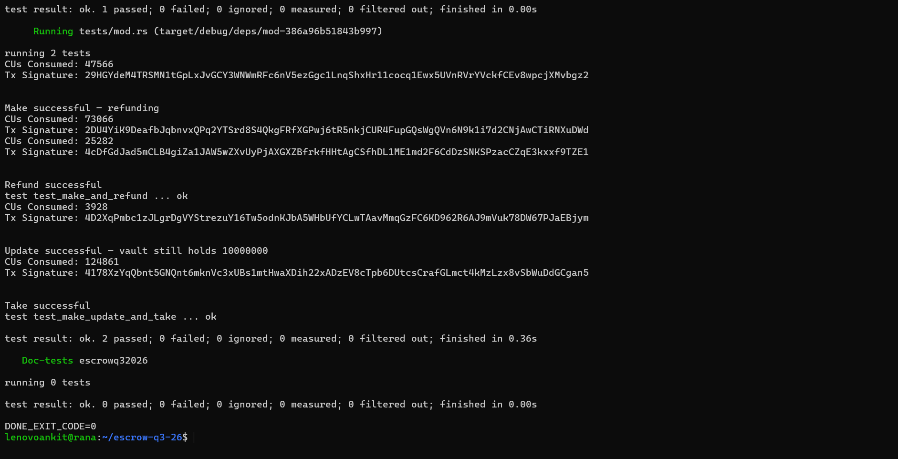

# Escrow Program — Q3 2026

An Anchor-based Solana escrow program implementing a full trustless swap flow between two parties, with tests written in Rust using [LiteSVM](https://github.com/LiteSVM/litesvm).

## Overview

This program lets a **Maker** deposit a token into a vault and specify how much of a different token they want in return. A **Taker** can then fulfill the trade, the Maker can cancel and get a **refund**, and the Maker can **update** the terms of an open offer before it's taken.

## Instructions

| Instruction | Description |
|---|---|
| `make` | Maker creates an escrow account and deposits Token A into a program-owned vault, specifying the amount of Token B they want in return. |
| `take` | Taker sends the requested Token B to the Maker and receives the escrowed Token A from the vault. Closes the escrow account. |
| `refund` | Maker cancels an open escrow, reclaims their deposited Token A from the vault, and closes the escrow account. |
| `update` | Maker changes the terms (e.g. requested amount) of an existing, not-yet-taken escrow. |

## Program Structure

```
programs/escrowq32026/
├── src/
│   ├── instructions/
│   │   ├── make.rs
│   │   ├── take.rs
│   │   ├── refund.rs
│   │   └── update.rs
│   ├── state/
│   └── lib.rs
tests/
└── mod.rs
```

## Tests

Tests are written in Rust using LiteSVM and run against a simulated validator, executing real transactions with signatures returned for each instruction.

Run with:

```bash
cargo test
```

**Test coverage:**

- **`test_make_and_refund`** — creates an escrow via `make`, then cancels it via `refund`, verifying the vault returns funds to the Maker.
- **`test_make_update_and_take`** — creates an escrow via `make`, modifies its terms via `update`, then completes the trade via `take`, verifying final vault and token balances.

Together these two tests exercise all four instructions end-to-end.

### Proof of passing tests



```
running 2 tests
test test_make_and_refund ... ok
test test_make_update_and_take ... ok

test result: ok. 2 passed; 0 failed; 0 ignored; 0 measured; 0 filtered out
```

## Setup

```bash
# Install dependencies
anchor build

# Run tests
cargo test
```

## Tech Stack

- **Anchor** — Solana program framework
- **Rust** — program + test language
- **LiteSVM** — lightweight, fast in-process Solana VM for testing